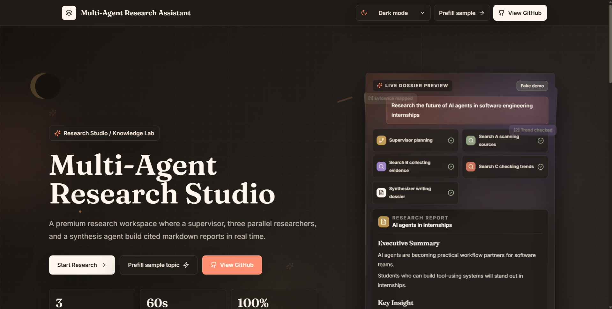
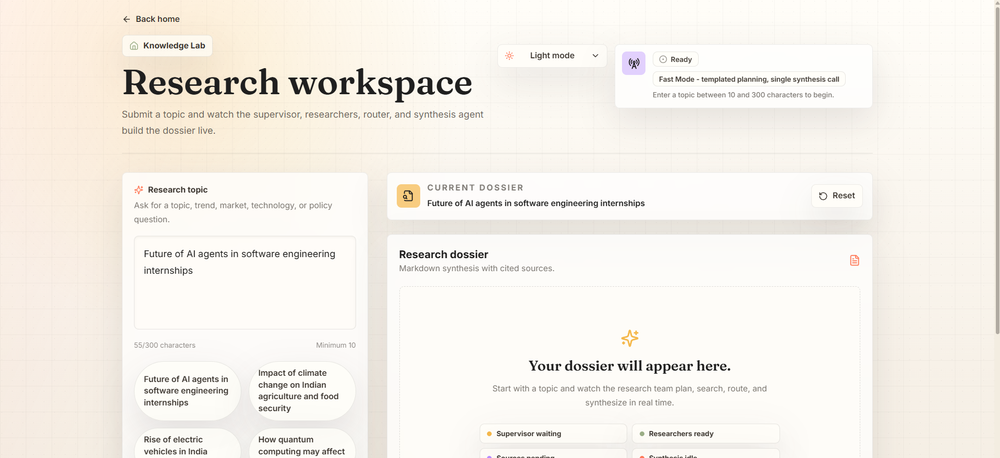
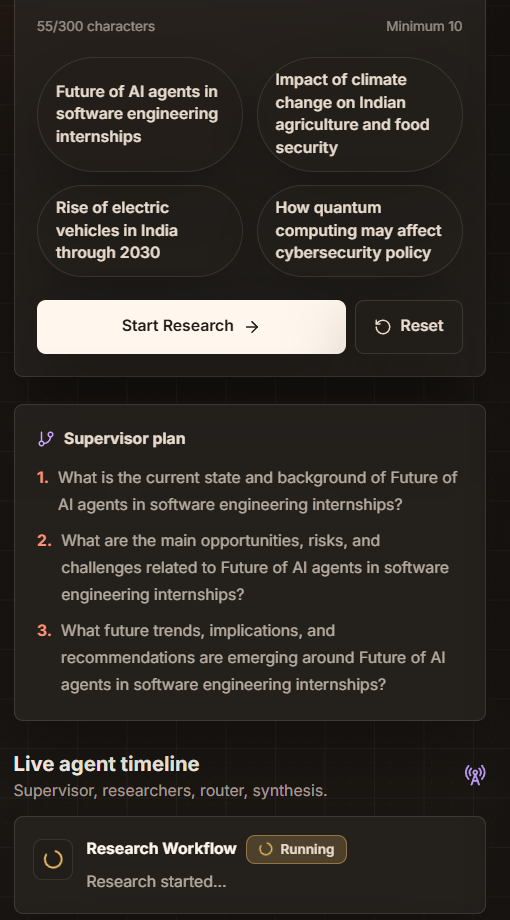
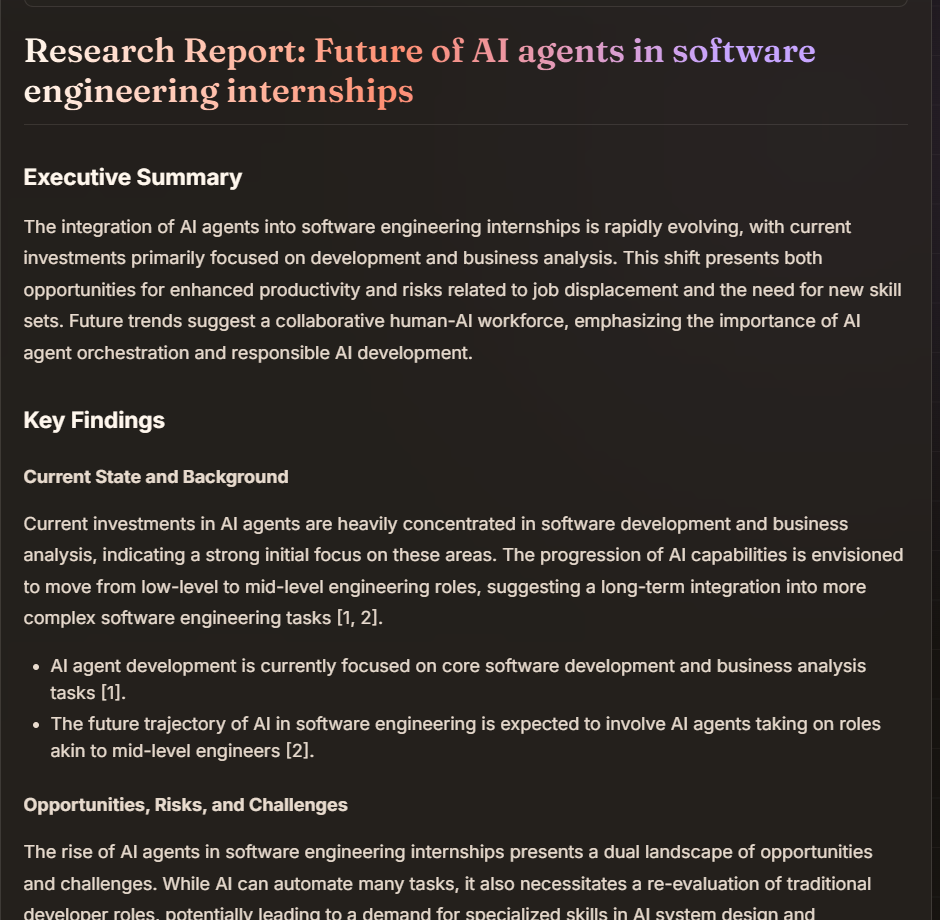
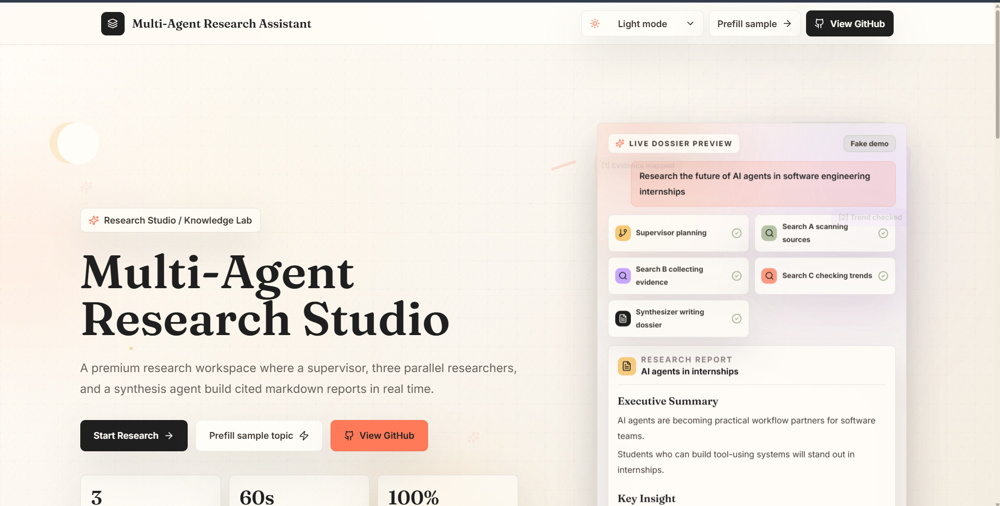
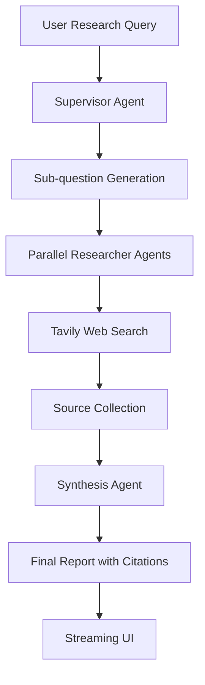

# Multi-Agent Research Assistant

A full-stack AI research assistant that uses multiple agents to break down a research topic, search the web, gather sources, and synthesize a structured report with citations.

**Live demo:** [multi-agent-research-assistant-delta.vercel.app](https://multi-agent-research-assistant-delta.vercel.app/)

## Key Features

- Multi-agent research workflow
- Supervisor agent for task planning
- Multiple researcher agents
- Synthesis agent for final report generation
- Source-backed research output
- Live agent timeline
- Streaming research progress
- Structured markdown report
- Web search integration with Tavily
- Gemini-powered reasoning
- Responsive dashboard UI
- Light/dark mode
- Professional animated interface

## Tech Stack

- Next.js
- React
- TypeScript
- Tailwind CSS
- LangGraph
- Gemini API
- Tavily API
- Vercel
- Framer Motion

## Screenshots











TODO: Add `./screenshots/sources.png` when a dedicated sources screenshot is captured.

## System Architecture



```txt
User Research Query
-> Supervisor Agent
-> Sub-question Generation
-> Parallel Researcher Agents
-> Tavily Web Search
-> Source Collection
-> Synthesis Agent
-> Final Report with Citations
-> Streaming UI
```

The Next.js API route validates the topic, checks server-side API configuration, starts the LangGraph workflow, and streams progress events back to the research workspace. The UI renders each agent step as it happens, then displays sources and the final markdown report.

## Agent Workflow

- The supervisor splits the user topic into focused sub-questions.
- Researcher agents search the web and collect relevant sources for each sub-question.
- The synthesis agent combines successful findings into one structured final report.
- The UI streams progress so users can see each agent step in real time.

## Environment Variables

Create `.env.local` from `.env.example` and add your own values:

```env
GEMINI_API_KEY=
GOOGLE_API_KEY=
TAVILY_API_KEY=
NEXT_PUBLIC_APP_URL=
```

Notes:

- Do not commit `.env.local`.
- API keys are server-side only.
- Add the same environment variables in Vercel before deployment.
- The app supports either `GEMINI_API_KEY` or `GOOGLE_API_KEY` for Gemini access.

## Local Setup

```bash
npm install
npm run dev
npm run build
```

For local development, copy the example environment file first:

```bash
cp .env.example .env.local
```

On Windows PowerShell:

```powershell
Copy-Item .env.example .env.local
```

Then open [http://localhost:3000](http://localhost:3000).

## Usage

1. Enter a research topic.
2. Start research.
3. Watch the agents work in real time.
4. Review generated sources.
5. Read the final synthesized report.

## Deployment

This project is deployed on Vercel.

To deploy your own copy:

1. Push the repository to GitHub.
2. Import the project into Vercel.
3. Add the required environment variables in Vercel Project Settings.
4. Deploy with the default Next.js settings.

## Project Status

Production-style portfolio project / active development.

## Future Improvements

- Save research history
- Export report as PDF/Markdown
- User authentication
- Better source ranking
- Research depth selector
- More agent roles
- Database persistence
- Team collaboration

## Portfolio Note

This project is built for learning, portfolio, and AI research workflow demonstration.
