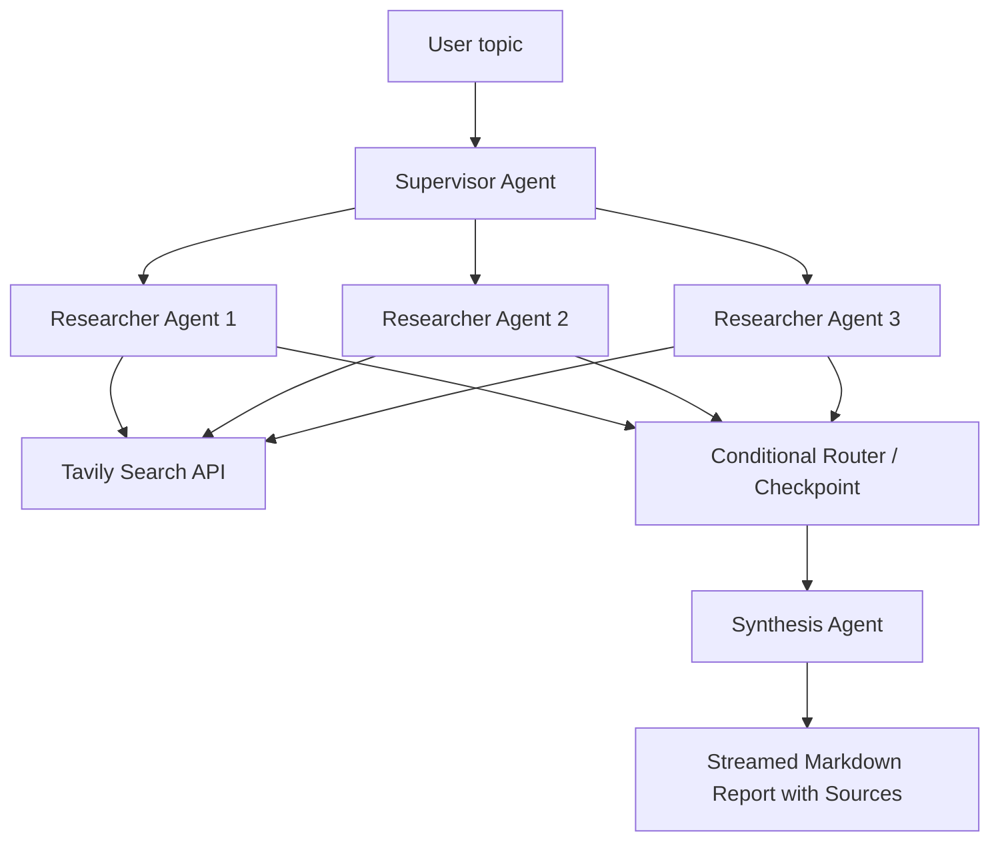

# Multi-Agent Research Assistant

A premium Research Studio built with Next.js 14 that streams a LangGraph-style multi-agent workflow from topic planning to cited markdown synthesis.

## Screenshot

Screenshot placeholder: run the app locally, submit a topic, and add a screenshot of the warm Research Studio UI here for your portfolio.

## Architecture Diagram



## Agent Explanation

- Supervisor Agent: generates sub-questions locally in Fast Mode, or uses Gemini 2.5 Flash Lite when full-agent mode is enabled.
- Researcher Agents: run in parallel, call Tavily Search, summarize evidence, and return recoverable errors if one branch fails.
- Conditional Router: proceeds to synthesis when at least one researcher succeeds and fails gracefully when all researchers fail.
- Synthesis Agent: combines successful findings into a structured markdown dossier with numbered citations.
- Streaming API: sends SSE-style events through a `fetch()` POST stream so the UI can update timeline steps, sources, and reports live.

## Tech Stack

- Next.js 14 App Router
- TypeScript
- Tailwind CSS
- Framer Motion
- lucide-react
- react-markdown and remark-gfm
- LangGraph / LangChain
- Gemini 2.5 Flash Lite
- Tavily Search API

## Features

- Warm ivory, clay, coral, sage, amber, and violet Research Studio design.
- CSS 3D floating research objects with lightweight motion.
- Topic validation on both frontend and backend.
- AbortController-powered stop button for in-flight research requests.
- Reset button that clears topic, timeline, report, sources, and errors.
- Copy report button for markdown output.
- Source cards with working external links.
- Friendly missing-key errors for empty or placeholder environment values.

## Environment Variables

Create `.env.local` from `.env.example` and add real keys:

```env
GOOGLE_API_KEY=your_real_key_here
TAVILY_API_KEY=your_real_key_here
GEMINI_MODEL=gemini-2.5-flash-lite
FAST_MODE=true
TAVILY_MAX_RESULTS=2
NEXT_PUBLIC_APP_URL=http://localhost:3000
```

`.env.local` is gitignored. Commit `.env.example`, not real API keys.

## Setup

```bash
npm install
```

If you do not already have `.env.local`, copy the example:

```bash
cp .env.example .env.local
```

On Windows PowerShell:

```powershell
Copy-Item .env.example .env.local
```

Add your real API keys locally before running real research. Never commit `.env.local`.

## Run Locally

```bash
npm run dev
```

Open [http://localhost:3000](http://localhost:3000), then choose **Start Research** or visit `/research`.

## Build

```bash
npm run build
```

## Deploy To Vercel

1. Push the repository to GitHub.
2. Import the project in Vercel.
3. Add `GOOGLE_API_KEY`, `TAVILY_API_KEY`, `GEMINI_MODEL`, `FAST_MODE`, `TAVILY_MAX_RESULTS`, and `NEXT_PUBLIC_APP_URL` in Vercel Project Settings.
4. Deploy with the default Next.js settings.

The research API route uses `runtime = "nodejs"`, `dynamic = "force-dynamic"`, and `maxDuration = 60` for streamed responses.

## Fixing Missing GOOGLE_API_KEY Locally

If the app says `Missing GOOGLE_API_KEY`:

1. Make sure `.env.local` is in the same folder as `package.json`.
2. Make sure the variable is named exactly `GOOGLE_API_KEY`.
3. Do not add spaces around `=`.
4. Do not wrap the key in quotes.
5. Restart the dev server after editing `.env.local`.

Correct:

```env
GOOGLE_API_KEY=your_real_gemini_key_here
TAVILY_API_KEY=your_real_tavily_key_here
GEMINI_MODEL=gemini-2.5-flash-lite
FAST_MODE=true
TAVILY_MAX_RESULTS=2
NEXT_PUBLIC_APP_URL=http://localhost:3000
```

Restart:

```bash
Ctrl + C
npm run dev
```

Safe local check:

```txt
http://localhost:3000/api/env-check
```

If you get `models/gemini-1.5-flash is not found`, set:

```env
GEMINI_MODEL=gemini-2.5-flash-lite
```

Then restart:

```bash
Ctrl + C
npm run dev
```

## Performance Mode

By default the app runs in Fast Mode:

```env
FAST_MODE=true
GEMINI_MODEL=gemini-2.5-flash-lite
TAVILY_MAX_RESULTS=2
```

Fast Mode reduces LLM calls by:

- Generating supervisor questions locally.
- Using Tavily snippets directly in researcher agents.
- Using one final Gemini call for synthesis.

For a more expensive full-agent mode:

```env
FAST_MODE=false
```

## Resume Bullet

Built a Multi-Agent Research Assistant using Next.js 14, LangGraph, Gemini, and Tavily Search API that autonomously breaks research topics into sub-questions, runs parallel web searches, and synthesizes structured markdown reports with cited sources — streamed live to the UI.

## Notes

- The requested `tavily-js@0.5.0` package name is not published on npm. This project uses the official Tavily JavaScript SDK package `@tavily/core@0.5.0`, pinned exactly.
- The frontend reads SSE-style events with `fetch()` and a chunk-safe buffer parser.
- API keys are only read on the server. No secret keys are exposed to the frontend.
