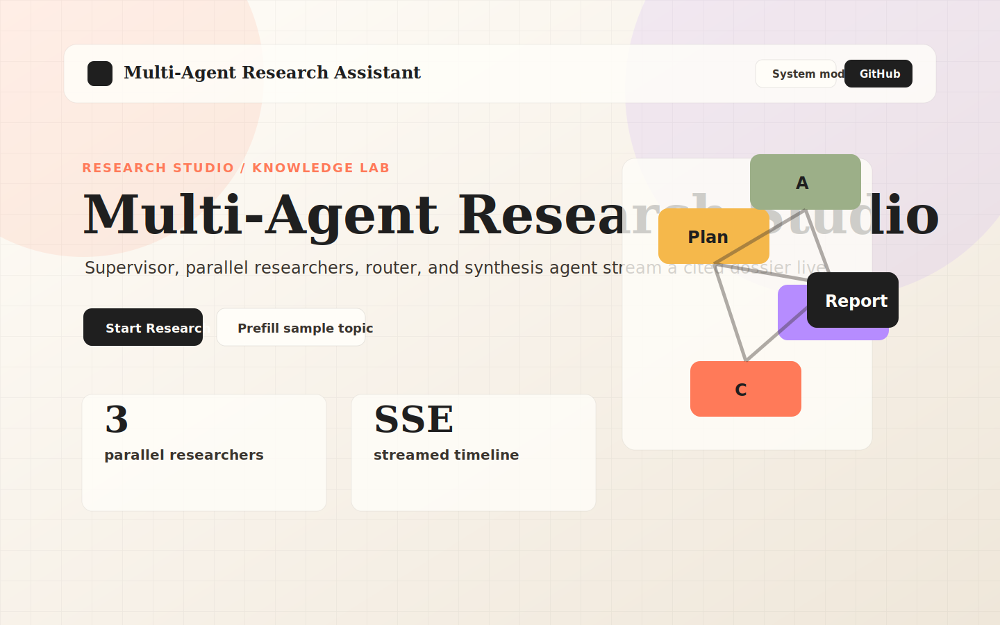
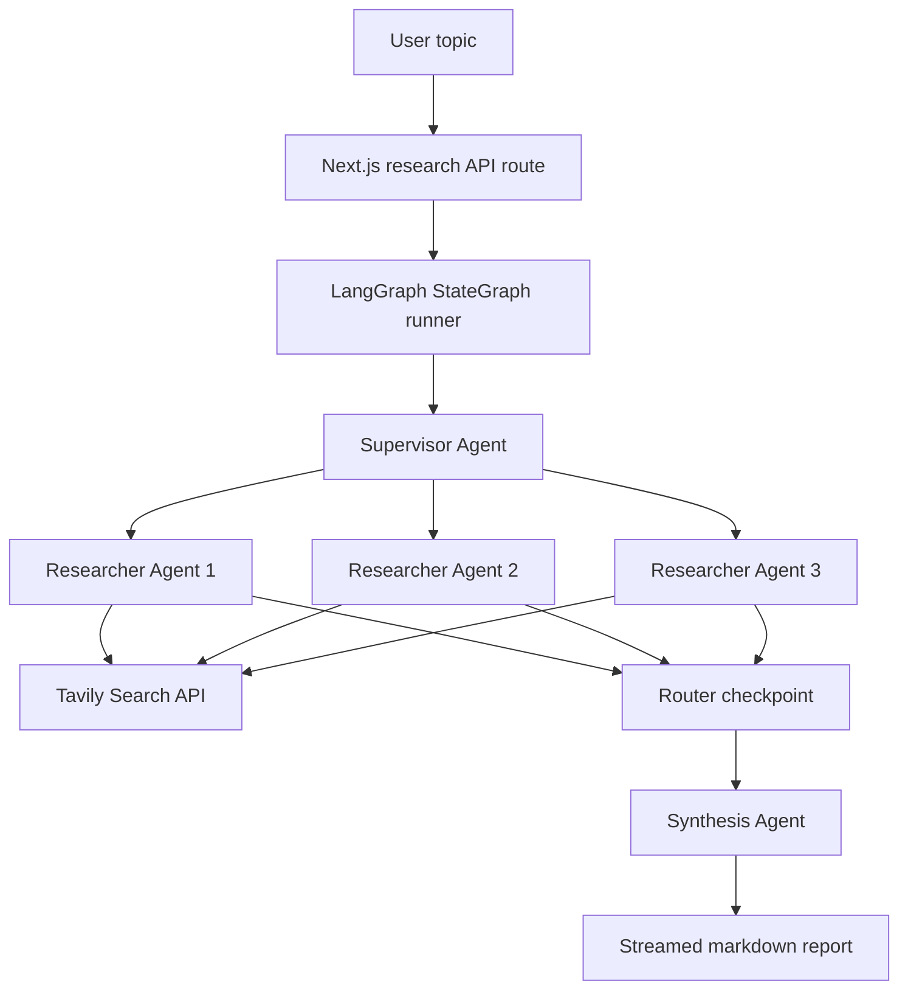

# Multi-Agent Research Assistant

A polished Research Studio built with Next.js 14, TypeScript, LangGraph, Gemini, Tavily Search, Tailwind CSS, and Framer Motion. It breaks a research topic into focused sub-questions, runs parallel web research, and streams a cited markdown dossier to the UI.

Live site: [multi-agent-research-assistant-delta.vercel.app](https://multi-agent-research-assistant-delta.vercel.app/)

## Screenshot



## Architecture



The API route calls `runResearchGraph({ topic, emit })` from `agents/graph.ts`. The compiled LangGraph owns the supervisor, parallel researcher, router, and synthesizer nodes. The route still owns SSE framing, validation, cache lookup, final error mapping, and Vercel-safe response headers.

## Streaming Contract

The frontend consumes SSE-style chunks from a `fetch()` POST stream. Event types are kept stable for the research workspace:

```txt
research_started
agent_started
agent_completed
agent_failed
subquestions_ready
sources_ready
synthesis_started
report_ready
research_completed
cache_hit
error
done
```

## Agent Modes

Fast Mode is enabled by default:

```env
FAST_MODE=true
```

Fast Mode uses templated supervisor planning, Tavily snippets inside each researcher, and one final Gemini synthesis call. This keeps demos quicker and less expensive.

Full Agent Mode can be enabled with:

```env
FAST_MODE=false
```

Full Agent Mode uses Gemini at the supervisor, researcher, and synthesis stages.

## Cache Behavior

The app uses a small in-memory `Map` cache as a best-effort optimization for recent topics. It is useful during local development and warm server instances, but it is not persistent across Vercel serverless instances, cold starts, or deployments. The UI still supports the `cache_hit` event when a local cache entry is available.

## Features

- LangGraph-backed multi-agent workflow with resilient routing.
- Parallel Tavily researchers with graceful per-agent failure handling.
- Live SSE timeline, source cards, and markdown report rendering.
- Fast Mode / Full Agent Mode badge in the research workspace.
- Light, dark, and system theme switching with local persistence.
- Warm editorial light theme and graphite/espresso dark theme.
- Production-safe user errors and local-only environment diagnostics.
- Accessible topic textarea label, clear external link labels, and reduced-motion support.
- App Router metadata, favicon, and Open Graph image.
- ESLint and Vitest coverage for pure helper functions.

## Environment Variables

Create `.env.local` from `.env.example` and add real keys:

```env
GOOGLE_API_KEY=your_real_key_here
TAVILY_API_KEY=your_real_key_here
GEMINI_MODEL=gemini-2.5-flash-lite
FAST_MODE=true
TAVILY_MAX_RESULTS=2
NEXT_PUBLIC_APP_URL=https://multi-agent-research-assistant-delta.vercel.app/
```

`.env.local` is gitignored. Commit `.env.example`, never real API keys.

The safe environment check route returns booleans only:

```txt
/api/env-check
```

## Local Setup

```bash
npm install
cp .env.example .env.local
npm run dev
```

On Windows PowerShell:

```powershell
Copy-Item .env.example .env.local
npm run dev
```

Open [http://localhost:3000](http://localhost:3000).

If local API keys are not detected, the app shows a local-only message asking you to check `.env.local`, variable names, and restart `npm run dev`. Production users only see a temporary availability message.

## Scripts

```bash
npm run build
npm run lint
npm run test
npm run typecheck
```

## Deploy To Vercel

1. Push the repository to GitHub.
2. Import the project in Vercel.
3. Add `GOOGLE_API_KEY`, `TAVILY_API_KEY`, `GEMINI_MODEL`, `FAST_MODE`, `TAVILY_MAX_RESULTS`, and `NEXT_PUBLIC_APP_URL` in Vercel Project Settings.
4. Deploy with the default Next.js settings.

The research API uses:

```ts
export const runtime = "nodejs";
export const dynamic = "force-dynamic";
export const maxDuration = 60;
```

## Security Notes

- API keys are read only on the server.
- No `NEXT_PUBLIC_GOOGLE_API_KEY` or `NEXT_PUBLIC_TAVILY_API_KEY` is used.
- `.env.local` is ignored by git.
- `/api/env-check` returns only non-secret booleans/config flags.
- Production errors do not expose local setup instructions, key names, or stack traces.

## Resume Bullet

Built a Multi-Agent Research Assistant using Next.js 14, LangGraph, Gemini, and Tavily Search API that autonomously breaks research topics into sub-questions, runs parallel web searches, and synthesizes structured markdown reports with cited sources — streamed live to the UI.

## Notes

- The project uses the official Tavily JavaScript SDK package `@tavily/core@0.5.0`, pinned exactly.
- The sample CTA pre-fills a topic instead of auto-running the API, so visitors do not spend API calls unintentionally.
- The Open Graph image is stored at `app/opengraph-image.png`; the app icon is `app/icon.svg`.
