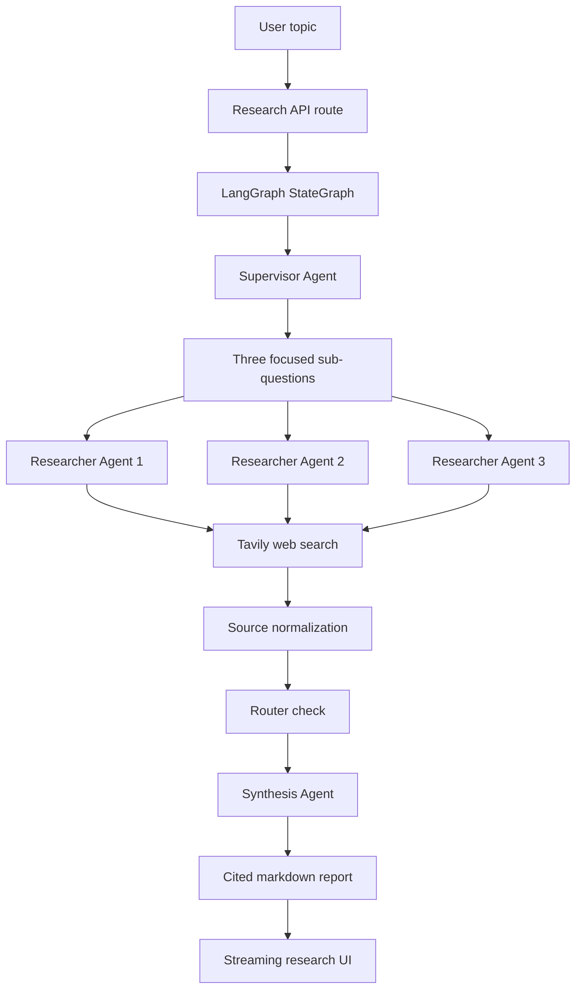

# Architecture

## Product Overview

Multi-Agent Research Assistant is a full-stack research workspace for turning a user topic into a cited markdown dossier. The product combines a Next.js dashboard, a LangGraph agent workflow, Tavily web search, and Gemini-powered synthesis.

The core experience is designed around visibility. Users submit a topic, watch each agent step stream into the interface, review collected sources, and read the final structured report.

## Agent Workflow



1. The supervisor agent converts the topic into three focused sub-questions.
2. Researcher agents run in parallel and collect source-backed findings through Tavily.
3. Sources are deduplicated and renumbered for consistent citations.
4. The router checks whether at least one researcher succeeded.
5. The synthesis agent writes a concise markdown report using only the collected findings and sources.
6. The UI streams status, sources, and report output to the user.

## API Flow

The main research endpoint is `app/api/research/route.ts`.

Request flow:

```txt
POST /api/research
-> validate topic
-> check Gemini and Tavily API keys
-> check in-memory cache
-> run LangGraph workflow
-> stream agent events
-> cache successful result
-> return final report event
```

The route runs with the Next.js Node.js runtime and is configured for dynamic responses. It keeps API keys on the server, maps provider errors to user-safe messages, and sends text/event-stream compatible chunks back to the client.

## Streaming Flow

The frontend reads a streamed `fetch()` response and handles event payloads as they arrive.

Important event types include:

- `research_started`
- `agent_started`
- `agent_completed`
- `agent_failed`
- `subquestions_ready`
- `sources_ready`
- `synthesis_started`
- `report_ready`
- `research_completed`
- `cache_hit`
- `error`
- `done`

This lets the UI show the supervisor plan, researcher progress, source collection, and synthesis output without waiting for the full workflow to finish.

## Environment Variable Setup

Required values:

```env
GEMINI_API_KEY=
GOOGLE_API_KEY=
TAVILY_API_KEY=
NEXT_PUBLIC_APP_URL=
```

Configuration notes:

- Keep real values in `.env.local` for local development.
- Never commit `.env.local` or production secrets.
- Add the same variables in Vercel Project Settings before deployment.
- Gemini access can be configured through `GEMINI_API_KEY` or `GOOGLE_API_KEY`.
- `NEXT_PUBLIC_APP_URL` is safe to expose because it contains the public app URL, not a secret.

## Deployment Notes

The project is deployed on Vercel. A typical deployment uses the default Next.js build settings:

```bash
npm install
npm run build
npm run start
```

Before deploying, confirm that Gemini and Tavily keys are configured in the hosting environment. The app should never rely on committed secrets.

## Future Improvements

- Save research history
- Export report as PDF/Markdown
- User authentication
- Better source ranking
- Research depth selector
- More agent roles
- Database persistence
- Team collaboration
